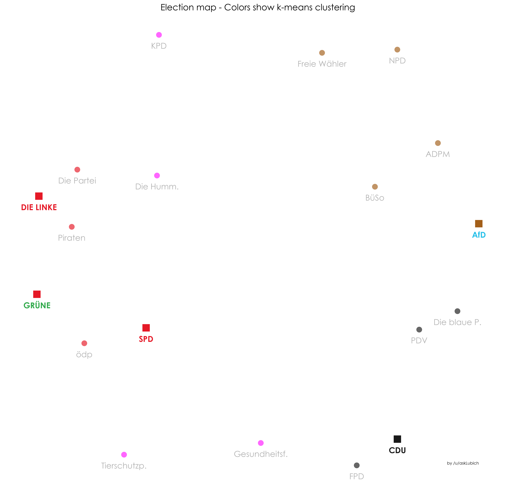
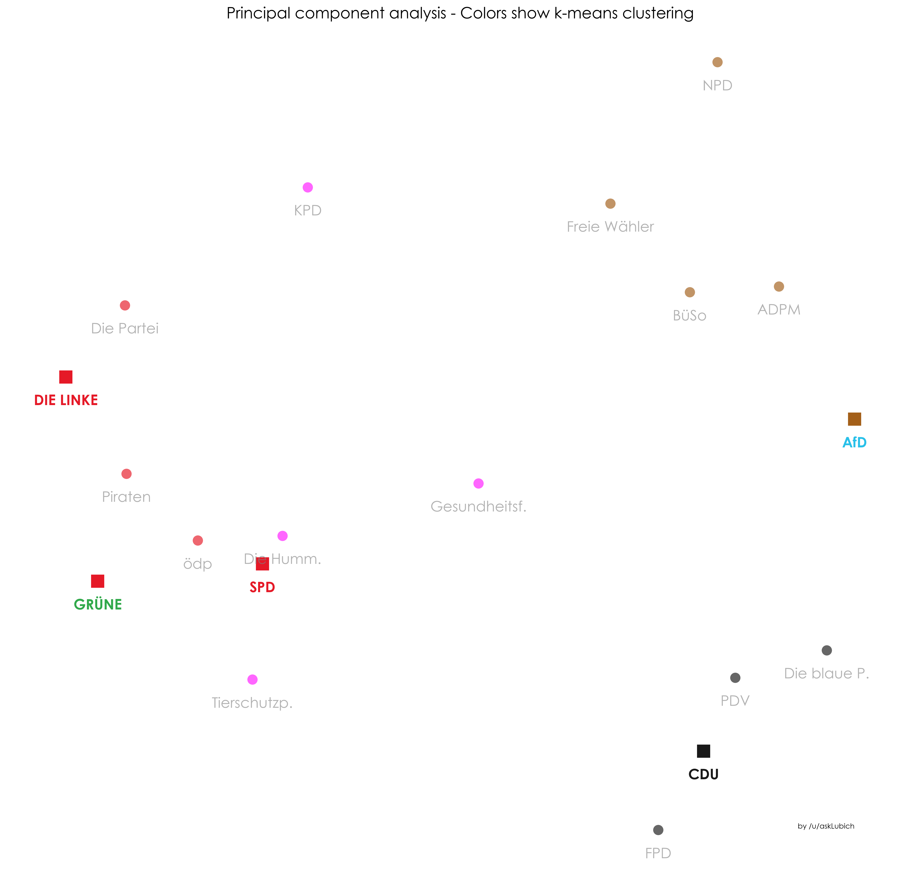
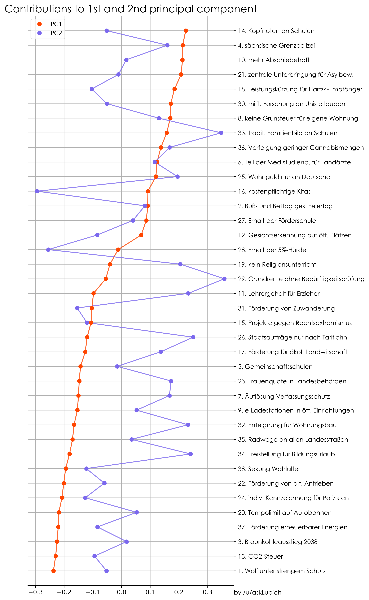

# Analysing the Wahl-O-Mat about the 2019 Saxony election

### Results

The figure below shows how well two political parties aggree (using a normalized L1-distance) based on the 38 replies each party provided to the Wahl-O-Mat hypotheses. 
Here, 100% denotes full aggreement.

Figure 2 can bee seen as a "political map", where spacial proximity symbolises political proximity. It is obtained by energy-minimizing a 2-dimensional elastic network, 
constructed based on the pairwise party-distances in the full 38-dimensional Wahl-O-Mat reply space. Parties are colored based on a k-means clustering in full space.

Figure 3 is another "political map". This time, it is the result of a principal component analysis, of which the first principal component (PC1, horizontal axis in the figure)
roughly reproduces a political left-right spectrum.

Figure 4 visualizes the contributions of each Wahl-O-Mat question to the first two principal components. 
E.g. supporting a thesis with a strongly negative contribution to PC1 results in the party being moved 
to the left in Figure 3, i.e. denotes a more left-wing party.

### Prerequisites

* Python 2.7
* Jupyter Notebook
* Packages:
    * matplotlib
    * numpy
    
### License

This project is licensed under the GPL-3.0 - see the [LICENSE](LICENSE) file for details.